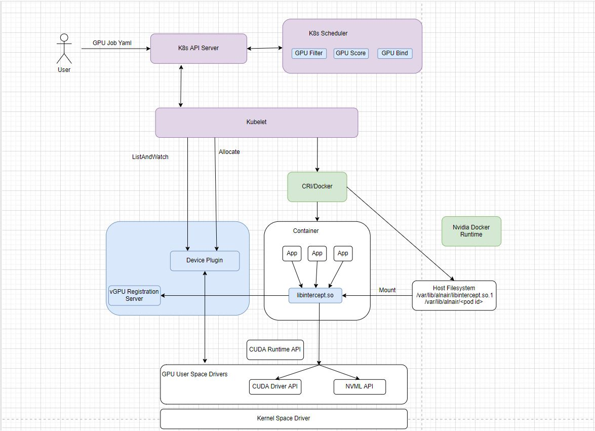
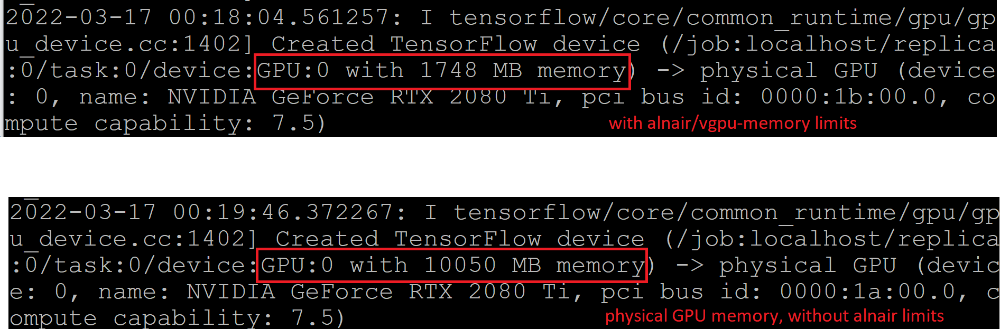
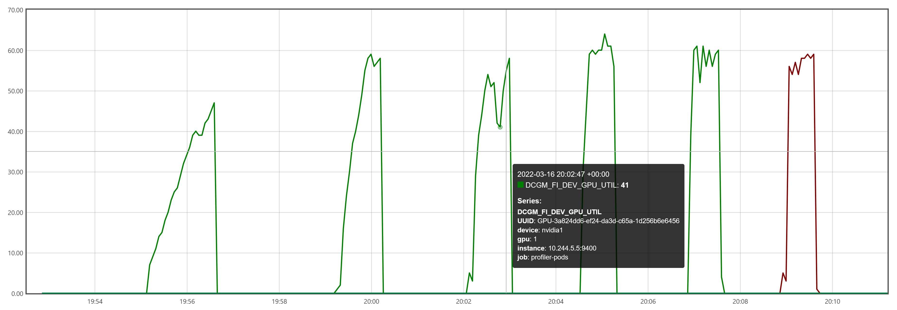

# Alnair Device Plugin (Kubernetes)
Alnair device plugin uses the Kubernetes extension mechanism [Device Plugin](https://kubernetes.io/docs/concepts/extend-kubernetes/compute-storage-net/device-plugins/) to enable the K8s managed containers to access Nvidia GPUs. It depends on the Nvidia docker runtime [nvidia-docker2](https://docs.nvidia.com/datacenter/cloud-native/container-toolkit/install-guide.html#docker). Compared with the [Nvidia Device Plugin](https://github.com/NVIDIA/k8s-device-plugin), Alnair amis to provide fractional GPU, GPU limits enforcement and GPU resources isolation among containers.

The GPU limits enforcement is done using the [LD_PRELOAD](https://osterlund.xyz/posts/2018-03-12-interceptiong-functions-c.html) mechanism. The specific library intercepted is the [CUDA driver API](https://docs.nvidia.com/cuda/cuda-driver-api/index.html). We choose to intercept at this level in order to support all CUDA applications as well as to have a stable public API.

The CUDA driver API interpose library can be found [here](https://github.com/CentaurusInfra/alnair/tree/main/intercept-lib)

## High level architecture diagram:


## Quick Start

### 1. Prerequisites
* Provision a Kubernetes cluster with at least one GPU node.
* Install [nvidia-container-runtime](https://github.com/NVIDIA/nvidia-container-runtime) and configure it as the default docker runtime. 
* A kubeconfig with enough permissions. 

**NOTE**: Don't install nvidia-docker2. We mount host /run directory to vgpu-server container. Nvidia-docker2 has conflicts with mounting /run. Error is like ``` stderr: nvidia-container-cli: mount error: file creation failed: /var/lib/docker/overlay2/XXXX/merged/run/nvidia-persistenced/socket: no such device or address: unknown"```. If this happens, you can purge all nvidia* packages and reinstall.  


### 2. Single Yaml Installation:

```kubectl apply -f https://raw.githubusercontent.com/CentaurusInfra/alnair/main/alnair-device-plugin/manifests/alnair-device-plugin.yaml```

The above manifest will install alnair device plugin and vgpu-server as two containers in the same pod. Intercept library is copied to from container to host machine through init container.

### 3. Manual Installation:
Please refer to the [CUDA interpose library](https://github.com/CentaurusInfra/alnair/tree/main/intercept-lib#steps)

### 4. vGPU Pod Example
```
apiVersion: v1
kind: Pod
metadata:
  name: gpu-pod
spec:
  containers:
    - name: cuda-container
      image: hxhp/elastic-horovod-demo:1.0
      resources:
        limits:
          alnair/vgpu-memory: 2
          alnair/vgpu-compute: 50 
      command: ["python", "/examples/tensorflow2_mnist.py"]
  restartPolicy: OnFailure
  ```
  ### 5. Results Verification
  #### 1. Memory limit 
  Depends on ML framework, GPU with smaller memory size can be seen at the begining of the program. In the actual running, if program allocates more then permitted memory, a OOM error will be thrown.
  
  
  
  #### 2. Compute limit
  Combine with profiler, GPU utilization can be viewed. The actual utilization should be no greater than the limits. However, different types of GPU cards may behave differently. Fine tune is required when apply to new types of GPUs. 
  
  The chart below is vGPU Pod example running on a RTX 2080 card with different settings of vgpu-compute limits. The last red one is from running on physical GPU without limits.
  
  
  
  
