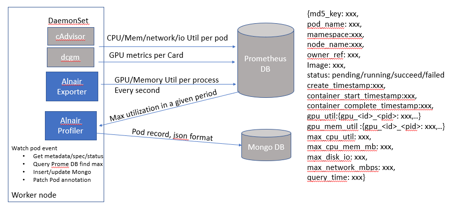
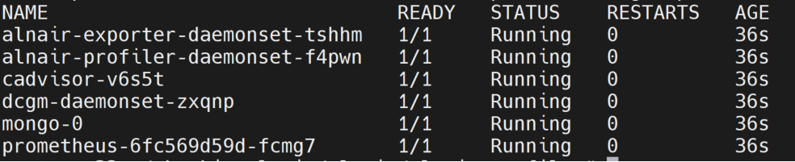
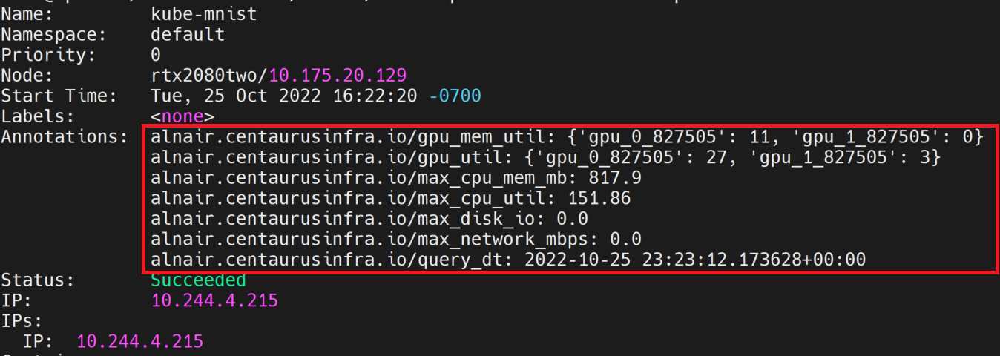
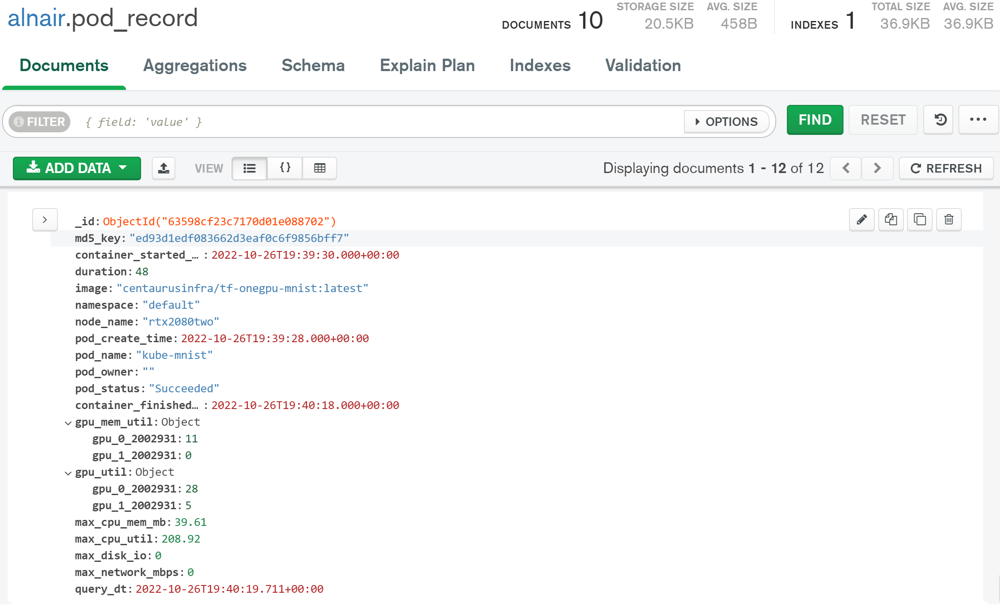
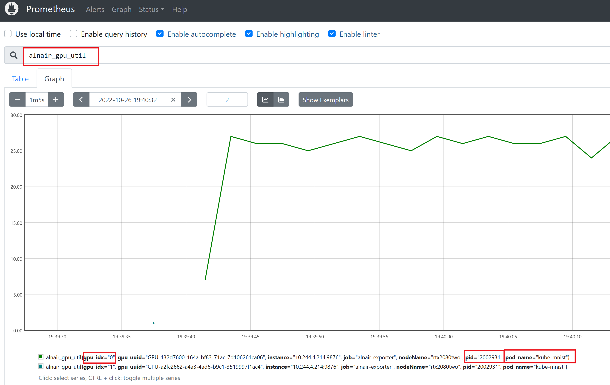

# Multifunctional Profiler


## Introduction
As deep learning advances, the GPU become increasingly important. GPU utilization is critical for cost reduction in cloud computing. GPU usage profiling is the first step to optimize resource utilization. A profiler is designed to collect and analyze GPU metrics at various level, e.g. Pod, Node, Job, CRD. Nvidia's monitoring tool DCGM exporter is used to collect GPU related metrics. cAdvisor is used to collect CPU related metrics. Prometheus is used to scrape and store metrics data. Analytical functions (cyclic pattern detection, trend forecasting) are built in the profiler to predict job type, utilization, etc. Analytical results are written back as part of objects' annotations. Besides monitoring and analyze GPU and CPU utilzation, profiler is able to generate short-term trial jobs with different device placement (assign different types and numbers of GPUs) and track the execution efficiency. Therefore, the GPU scheduling stragtegies can be dynamically optimizated with the consideration of the trial job results.

## System Diagram



## Quick Start
   
### 1. Prerequisite: 
 - A K8s cluster (tested on v1.21.4)
 - GPU node with Nvidia driver installed
 - GPU node with nvidia container runtime installed, docker default runtime is set to nvidia-container-runtime ([installation guide](https://github.com/NVIDIA/nvidia-container-runtime))

### 2. Install profiler

Alnair-profiler includes prometheus server, existing open-source and custom exporters, and mongo db for storing meta data and aggregated data. To install all the components, an all-in-one yaml file is generated by kubernetes kustomize.

```kubectl apply -f https://raw.githubusercontent.com/CentaurusInfra/alnair/main/alnair-profiler/profiler-all-in-one.yaml```

All the components will be installed under alnair namespace.



Modify [kustomization.yaml](./kustomization.yaml) file and re-compile to add or delete profiler components.

### 3. View profiler results

Pod resource utilization data are patched to pod annoation. Sample results are like the following.



The complete pod record including metadata and resource utilization data is stored in MongoDB as following.



In addition, GPU metrics can be viewed through Prometheus's web UI. In the ```prometheus-complete.yaml```, prometheus' container port is mapped to the host port for the sake of simiplicity. http://prometheus-node-ip:9090, the node-ip is the IP address of the node where Prometheus server is deployed. 

More information on Alnair custom metrics is described in Alnair-exporter.



### 4. Remove profiler and Prometheus

Profiler and Prometheus service can be deleted by the following commands.

```
kubectl delete -f profiler-all-in-one.yaml
```

