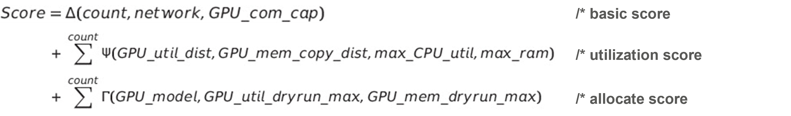

# Autonomous scheduler

## Introduction
To achieve the [Alnair project goals](https://github.com/CentaurusInfra/alnair), we need to customize the Kubernetes default scheduler so that the proposed platform with higher efficiency and intelligence can be implemented on top of the Kubernetes infrastructure:

1) Cooperating with the [Alnair/elastic-training module](https://github.com/CentaurusInfra/alnair/tree/main/elastic-training), the scheduler alleviates the race condition in a scale up/down process of elastic training. The feature is mainly implemented via the co-scheduling plugin. 

2) Cooperating with the [Alnair/fine-grained-sharing module](https://github.com/CentaurusInfra/alnair/tree/main/fine-grained-sharing), the scheduler allocates the GPU resource requests according to ''amount of GPU memory in MiB'' rather than ''number of GPUs''. Plus, the scheduling policy needs to take ''the topology of GPUs'' into the consideration, and this feature is mainly implemented via the NodeAffinity plugin. 

3) Cooperating with the [Alnair/profilling module](https://github.com/CentaurusInfra/alnair/tree/main/profiling), the scheduler assigns the GPU-related Pods to suitable Nodes according to the current cluster utilization. This feature is mainly implemented via the UtilSched plugin. 

The proposed autonomous scheduler are based on [the scheduling-framework](https://github.com/kubernetes/enhancements/blob/master/keps/sig-scheduling/20180409-scheduling-framework.md) of Kubernetes. The APIs of scheduling-framework allow most scheduling features to be implemented as plugins, while keeping the scheduling core more maintainable. As shown in the diagram, the framework defines a few extension points in both the scheduling cycle and the binding cycle. Our design of plugins are registered and invoked at one or more extension points to change the scheduling decisions, respectively. 


### Initial GPU Allocator 

Initial GPU allocator is a component in our [elastic-training module](../elastic-training/controllers/scheduler.go). Once an ElasticHorovodJob is first submitted by the user, the initial GPU allocator will calculate the most suitable number of GPUs the job should use. Then, the implemented scheduler endpoints will be invoked as per the Kubernetes scheduling-framework. 

### Co-Scheduling Plugin

Currently, through the default scheduler of Kubernetes, we cannot ensure a group of pods can be scheduled altogether. Under some scenes, it would waste resources since the whole application cannot work with only partial Pods' running, like Spark jobs, TensorFlow jobs, and so on. 

In our co-scheduling plugin, the atomicity is ensured in worker pods — that is, if one or more of the pods spawned by a StatefulSet, Deployment, or other similar Resources cannot pass through due to race conditions or other issues, the scheduler will reject the other pods that belong to the same PodGroup. In other words, it is an all-or-nothing approach. 

This co-scheduling implementation is based on the Kubernetes-SIGs [scheduler-plugins](https://github.dcom/kubernetes-sigs/scheduler-plugins) repository. 

### NodeAffinity Plugin

This plugin enables scheduling decisions based on worker node hardware topology. Ideally, the scheduler should not try to place a pod onto a node where certain topology policy is violated (e.g., a single NUMA node is requested). Currently, because the default scheduler of Kubernetes is not topology-aware, once the topology affinity error happens and pod fails, the ReplicaSet will create another pod, repeat the error again, and waste CPU time constantly.  

The proposed NodeAffinity plugin leverages the NodeResourceTopology CRD instance corresponding to the nodes to obtain the resource topology information to make a topology-aware scheduling decision. This co-scheduling implementation is based on the Kubernetes-SIGs [scheduler-plugins](https://github.dcom/kubernetes-sigs/scheduler-plugins) repository. 

### UtilSched Plugin

As a sub-project of [Alnair](https://github.com/CentaurusInfra/alnair), it can cooperate with the [profilling module](https://github.com/CentaurusInfra/alnair/tree/main/profiling) to schedule GPU tasks according to the current cluster utilization. The goal is to make the Kubernetes scheduler aware of the gap between resource allocation and actual resource utilization and pack pods more efficiently. 

As discussed in the [profilling module](https://github.com/CentaurusInfra/alnair/tree/main/profiling), profiler results are written into cluster nodes' annotations. With ```kubectl describe node <your-node-name> | grep ai.centaurus.io```, we can find the metrics it collected including GPU architecture, GPU memory size, GPU utilization rate, I/O bandwidth, and so on. By default, profiler will update annotations every 30 seconds.

With the above collected utilization metrics, the UtilSched plugin will aggregate them via a customized score function which includes three components as shown in the equation. The basic score indicates a static measure of a specific node. The utilization score measures the real-time utilization rate of nodes. The allocated score aggregates the metrics information from the dry-run process of a Pod.  



## Quick Start