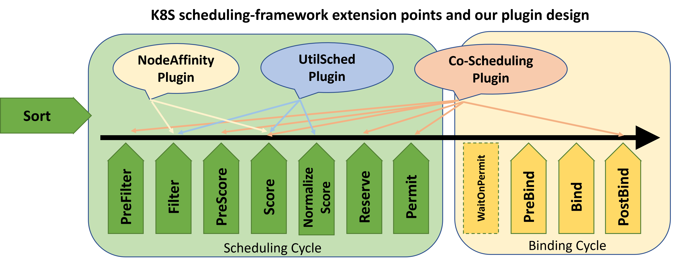

# UtilSched: A Cluster-`Util`ization-Driven K8S `Sched`uler 


UtilSched is a customized kubernetes scheduler based on [scheduling-framework](https://github.com/kubernetes/enhancements/blob/master/keps/sig-scheduling/20180409-scheduling-framework.md). The APIs of scheduling framework allow most scheduling features to be implemented as plugins, while keeping the scheduling core more maintainable. As shown in the diagram, the framework defines a few extension points in both the scheduling cycle and the binding cycle. Our design of plugins are registered and invoked at one or more extension points to change the scheduling decisions, respectively. 

As a sub-project of [Alnair](https://github.com/CentaurusInfra/alnair), UtilSched scheduler can cooperate with the [Alnair/profilling module](https://github.com/CentaurusInfra/alnair/tree/main/profiling) to schedule GPU tasks according to the current cluster utilization. 

The later version will also support: 
1) Cooperating with the [Alnair/elastic-training module](https://github.com/CentaurusInfra/alnair/tree/main/elastic-training) to alleviate race conditions in a scale up/down process. The feature is mainly implemented via the co-scheduling plugin. 
2) Cooperating with the [Alnair/fine-grained-sharing module](https://github.com/CentaurusInfra/alnair/tree/main/fine-grained-sharing) to schedule GPU tasks with granularity less than 1. The feature is mainly implemented via the NodeAffinity plugin. 

### Diagram of K8S scheduling-framework and our design



- Please note this version of UtilSched scheduler follows a out-of-tree scheduler design, and compile a scheduler binary with the k8s core scheduler included. 
```go
func Register() *cobra.Command {
	return app.NewSchedulerCommand(
		app.WithPlugin(utilsched.Name, utilsched.New),
	)
}
```
More details of how to [install out-of-tree plugin](https://github.com/kubernetes-sigs/scheduler-plugins/blob/master/doc/install.md) can be found here. 
- Deploy UtilSched:
```
kubectl apply -f https://github.com/CentaurusInfra/alnair/tree/main/autonomous-scheduler/UtilSched/deploy/utilsched.yaml
```
- Check the scheduler status
```shell
kubectl get pods -n kube-system 
```
## Demo


