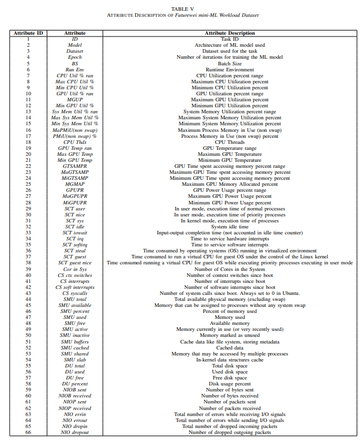
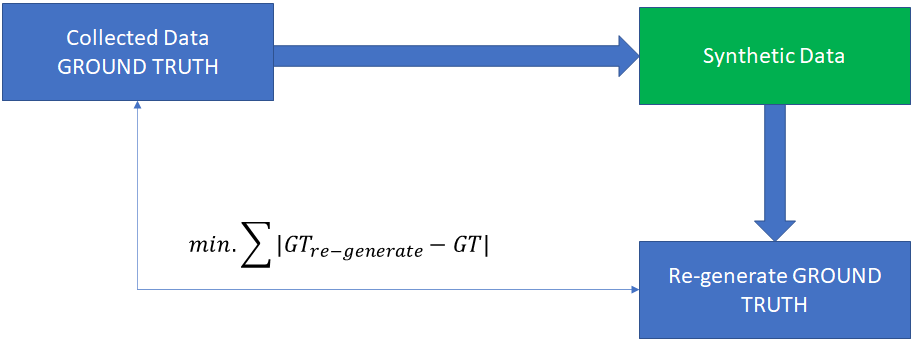
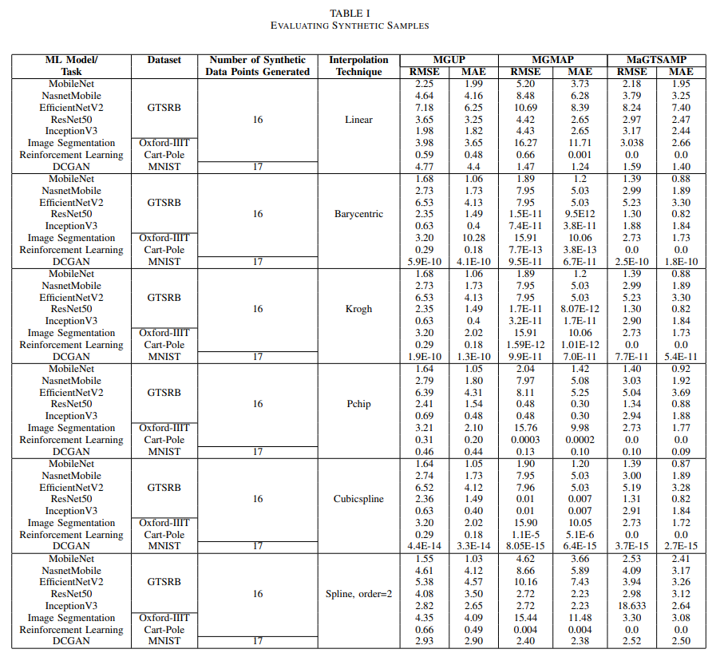
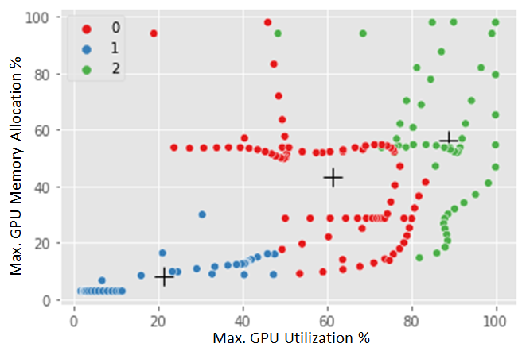
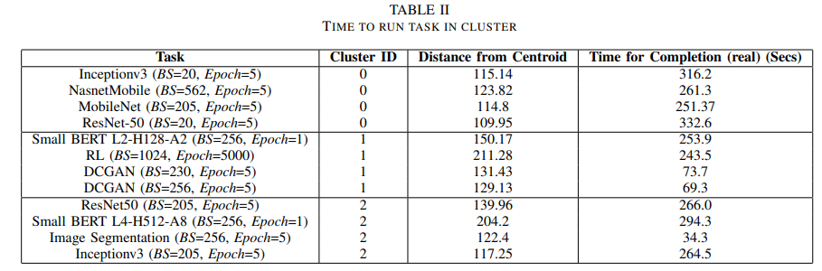
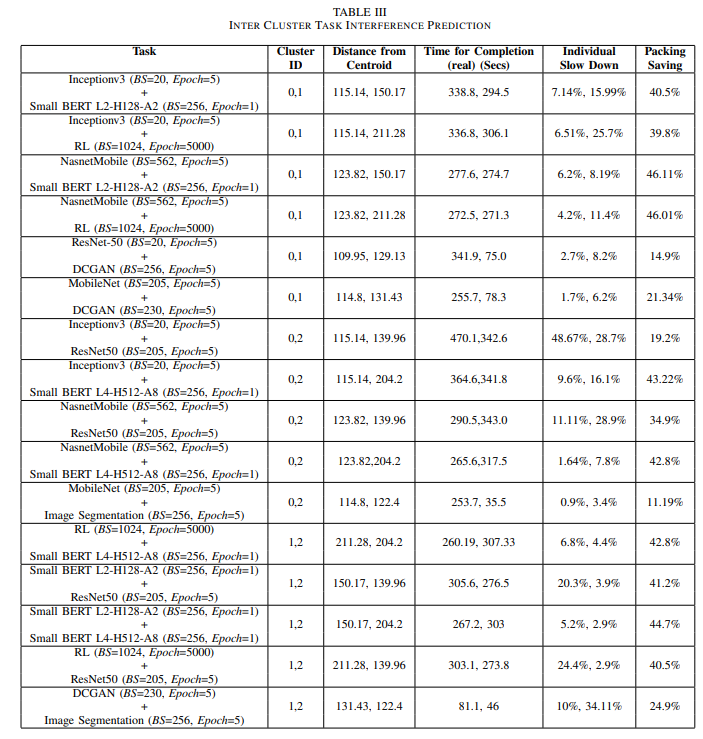

# AI Workloads resource utilization characterization 

## Goal
Predicting task Interference for GPU Sharing

Reduce Individual Job Slow Down while Maximizing Packing Saving when two job runs on a single GPU, concurrently. 

Target Variables: Maximum GPU Utilization Percent, and Maximum GPU Memory Allocated Percent 

## AI workloads description 
### Case 1: 
Image Classification on German Traffic Sign Recognition Benchmark (GTSRB) using standard ML architectures: MobileNet, NasnetMobile, EfficientNetV2, ResNet50, and InceptionV3. 

Code file: Image_Classification.py

### Case 2: 
Image Segmentation on Oxford-IIIT Pet Dataset (v-3.2.0) 

Code File: Image_Segmentation.py

### Case 3: 
Reinforcement Learning - Cart-Pole problem in OpenAI Gym suite environment 

Code File: RL_CartPole.py

### Case 4: 
Generative Adversarial Networks (GAN) - Deep Convolutional GAN for generating synthetic MNIST digits. 

Code File: DCGAN_MNIST.py

### Case 5: 
Natural Language Processing - Various BERT models fine-tuned for sentiment analysis on IMDB movie review dataset. 

Code File: NLP_BERT.py

## Experiments Env
Executed in Google Colaboratory Pro platform, Tesla P100 GPU. All implementation in TensorFlow. 

## Collected metrics and format
Pls refer to attached files

Collected Dataset: Dataset.xlsx

## Feature Selection
Coefficient of Determination (Pearson, Spearman, Kendall) 

Random Forests 

Ridge Regression 

Lasso Regression 

Code File: Feature_Selection.zip-(Record_Colab.xlsx, Feature_Selection.ipynb)

## Synthetic Data Generation 

Generation Strategy: Synthetic data is generated for selected attributes wrt Batch Size. Different interpolation techniques like Linear, Pchip, Barycentric, Krogh, Cubicspline, and Spline of order=2 is explored. For quality assessment of synthetic samples, we consider synthetic samples as pseudo-ground truth and re-generated collected data. Root Mean Square Error (RMSE), Mean Square Error (MSE), and Mean Absolute Error (MAE) metrics are used for quality assessment. 

Code File: Synthetic Data Generation Code.7z

## Clustering 
K-means clustering (with elbow method and distortion score) with relevant features and synthetic data. 

Code File: Clustering.7z

## Evaluating Task Interference
Evaluation Metrics: Individual Slow Down, Packing Saving. Evaluated on Futurewei Cluster. 

## Inferences

