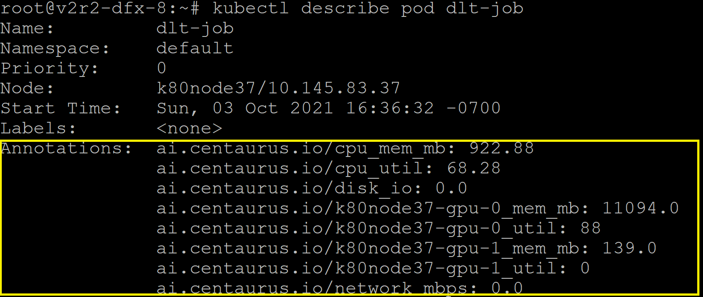
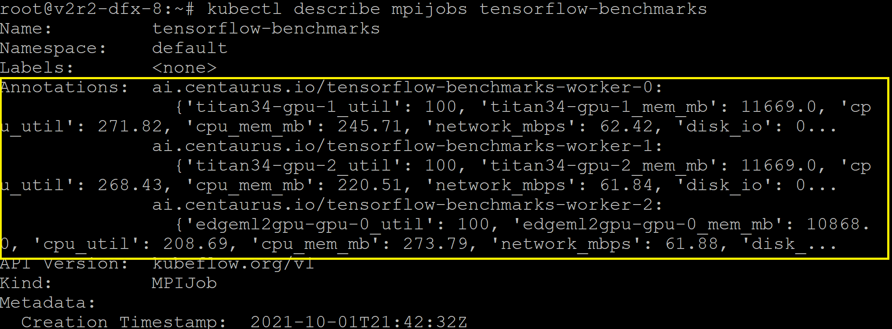
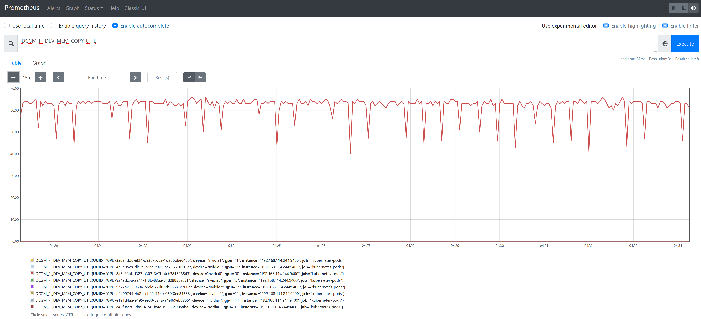

# Multifunctional Profiler


## Introduction
As deep learning advances, GPUs become increasingly important. GPU utilization is critical for cost reduction in cloud computing. GPU usage profiling is the first step to optimize resource utilization. A profiler is designed to collect and analyze GPU metrics at various level, e.g. Pod, Node, Job, CRD. Nvidia's monitoring tool DCGM exporter is used to collect GPU related metrics. cAdvisor is used to collect CPU related metrics. Prometheus is used to scrape and store metrics data. Analytical functions (cyclic pattern detection, trend forecasting) are built in the profiler to predict job type, utilization, etc. Analytical results are written back as part of objects' annotations. Besides monitoring and analyze GPU and CPU utilzation, profiler is able to generate short-term trial jobs with different device placement (assign different types and numbers of GPUs) and track the execution efficiency. Therefore, the GPU scheduling stragtegies can be dynamically optimizated with the consideration of the trial job results.

## System Diagram


## Quick Start
   
### 1. Prerequisite: 
 - K8s cluster with Nvidia GPU plugin installed
 - GPU node with Nvidia driver installed
 - GPU node with nvidia container runtime installed, docker default runtime is set to nvidia-container-runtime ([installation guide](https://github.com/NVIDIA/nvidia-container-runtime))

Detailed cluster installation guide can be refered [here](https://github.com/CentaurusInfra/alnair/blob/main/profiling/k8s-clusters/README.md).

### 2. Install profiler

To use profiler in a Kubernetes cluster, only two yaml files [prometheus-complete.yaml](https://github.com/CentaurusInfra/alnair/blob/main/profiling/prometheus-service/prometheus-complete.yaml), [profiler-dcgm-daemonset.yaml](https://github.com/CentaurusInfra/alnair/blob/main/profiling/profiler/profiler-dcgm-daemonset.yaml) need to be applied.
1. Install prometheus service with ```kubectl apply -f https://raw.githubusercontent.com/CentaurusInfra/alnair/main/profiling/prometheus-complete.yaml```
2. Install profiler daemon set with ```kubectl apply -f https://raw.githubusercontent.com/CentaurusInfra/alnair/main/profiling/profiler-dcgm-daemonset.yaml```

**Note**: Install the prometheus service first, since profiler needs to connect to Prometheus server and read metrics data.

### 3. View profiler results

Profiler results are written into cluster nodes' annotations. With ```kubectl describe node <your-node-name> | grep ai.centaurus.io```, results like the followings can be seen. By default, profiler will update annotations every 30 seconds, if memory utilization pattern changes.

<!--img  src="https://github.com/CentaurusInfra/alnair/blob/main/profiling/images/annotation_results.png" width="700" height="160"-->


Similarly, the results from profiler at pod level are annotated as following.



As for custom resource definition, we take an example of MPIJobs from kubeflow. For a distributed training job, multiple workers' resource utilzation results are aggregated at the job level. Workers (pods) will be deleted when job is done. The max resource utilization results are stored in the MPIjobs' annotations as following.



In addition, GPU metrics can be viewed through Prometheus's web UI. In the ```prometheus-complete.yaml```, prometheus' container port is mapped to the host port for the sake of simiplicity. http://prometheus-node-ip:9090, the node-ip is the IP address of the node where Prometheus server is deployed. 

<!--img  src="https://github.com/CentaurusInfra/alnair/blob/main/profiling/images/prometheus_UI.png" width="1000" height="500"-->




### 4. Remove profiler and Prometheus

Profiler and Prometheus service can be deleted by the following commands.

```
kubectl delete daemonset profiler
kubectl delete service prometheus
kubectl delete deployment prometheus
```

