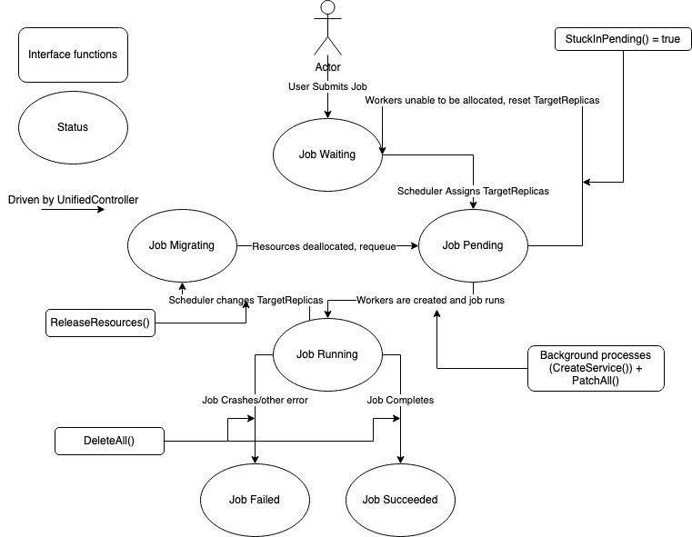

# Operator 

Operators for each ```UnifiedJob.JobType``` implement the UnifiedJobInterface (located in [unifiedjob_controller.go](../../controllers/unifiedjob_controller.go)) that follows a common logic flow. 



## Base Job 

The base job is simply a wrapper around the Kubernetes [Job](https://kubernetes.io/docs/concepts/workloads/controllers/job/); as such, it does not support multi-node allocations. Users may run whatever they want in their command. 

## Elastic Horovod 

[Elastic Horovod](https://horovod.readthedocs.io/en/stable/elastic_include.html) is a framework for Deep Learning, and the controller currently creates individual pods for each GPU (1 pod : 1 GPU architecture). The pods will stay asleep, whereby a launcher will run ```horovodrun``` and use the pods to run the job. The ElasticHorovod job does support multi-node allocations. Users must specify a python file and arguments, which will then be inserted into a greater ```horovodrun [...]``` command. 

## Elastic PyTorch 

[Elastic PyTorch](https://pytorch.org/elastic/0.1.0rc2/overview.html) is another framework for distributed deep learning. Currently, for faster training, the controller creates pods on a node basis (1 pod : n GPUs) – while the 1 pod : 1 GPU architecture offers greater control, the speed difference is significant. Every pod created in the controller will independently run its own command and so a headless service is required for each pod. Additionally, an etcd server and a service for that etcd server must be set up, but this is covered automatically by the controller. 