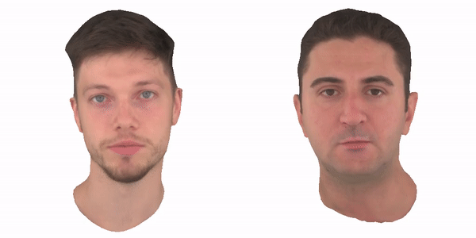

# An Implementation of Neural Head Avatars from Monocular RGB Videos

This is an implementation of neural head avatars. The code is heavily based on [this repo NerFace](https://github.com/gafniguy/4D-Facial-Avatars) [CVPR 2021] and [this repo Neural Head Avatar](https://github.com/philgras/neural-head-avatars) [CVPR 2022]. The target is to extrapolate unseen poses and view points of an animatable human avatar from a monocular RGB portrait video including a range of different expressions and views. 



## Installation

- Install Python3.9 following the instruction on https://www.python.org/

- This implementation requests `pytorch3d` to be installed and based on my experience, the best way to install `pytorch3d` is from Anaconda Cloud:
  - Install Anaconda/mimiconda following the instruction on https://docs.conda.io/projects/conda/en/latest/user-guide/install/linux.html#install-linux-silent.
  - conda create virtual environment: 
    ```angular2html
      conda create -n avatar python=3.9
      conda activate avatar
      ```
  - install torch and cuda, accordingly
    ```angular2html
      conda install -c pytorch pytorch=1.10.0 torchvision cudatoolkit=11.3
      conda install -c fvcore -c iopath -c conda-forge fvcore iopath 
      ```
  - install with CUDA support form Anaconda Cloud
    ```angular2html
      conda install pytorch3d -c pytorch3d
      conda install -c anaconda ffmpeg ## ffmpeg is for generating video clips 
      ```
- Git clone this repo and setup. 
```
git clone https://github.com/YHDING23/Imp_NeuAvatar.git 
pip install -e . 
```

## Quickstart with pretrained models

- Download pretrained models from [external website](https://edmond.mpdl.mpg.de/api/access/datafile/182303) or [our NFS]() `/nfs_2/Avatar/ckpts_and_data.tar.gz`. The folder layout:
```angular2html
    ckpts_and_data/
    ├── data   # frame-by-frame tracking results (face normal, parsing, landmark detection, etc.) from two subjects 
        ├── person_0000
        ├── person_0004
    ├── nha    # the pretrained models from two subjects
    ├── tracking    # the head tracking files (.npz)
```
- Download the flame head model ```generic_model.pkl``` from [external website](https://flame.is.tue.mpg.de/) or [our NFS]() ```/nfs_2/Avatar/generic_model.pkl```, and put `.pkl` file under `./assets/flame`

- run ```jupyter notebook jupyter_notebooks```, and find notebooks to run
  - Notebook 1. Manually adjust expression and pose parameters 
  - Notebook 2. Video-to-Video reenactment
  - Notebook 3. real-time reenactment (ongoing)


## Training an Avatar against your own video

To train a new avatar from scratch against a monocular .mp4 video, please follow these steps and make sure i) only one subject is visble in every frame, and ii) the head is turned in both directions to provide enough information. 

### Step 1. Preprocessing
The Step 1 and 2 here requests three existing models working together. 
- ```deps/face_normals```, it crops the input images into the fixed size around the face. The face normal map prediction model details can be found [this repo Face_Normals](https://github.com/boukhayma/face_normals/tree/5d6f21098b60dd5b43f82525383b2697df6e712b). Add ```model.pth``` obtained from [external website](https://drive.google.com/file/d/1Qb7CZbM13Zpksa30ywjXEEHHDcVWHju_) or [our NFS]() ```/nfs_2/Avatar/face_normals/model.pth``` to ```./assets/face_normals```.
- ```deps/face_parsing```, here we use this model for facial segmentation. The face parsing model details can be found [this repo Face Parsing](https://github.com/zllrunning/face-parsing.PyTorch/tree/d2e684cf1588b46145635e8fe7bcc29544e5537e).  Add ```model.pth``` obtained from [external website](https://drive.google.com/open?id=154JgKpzCPW82qINcVieuPH3fZ2e0P812) or [our NFS]() ```/nfs_2/Avatar/face_parsing/model.pth``` to ```./assets/face_parsing```.
- ```deps/rvm```, here we use this model for background matting. The ground matting model details can be found [this repo Robust Video Matting](https://github.com/PeterL1n/RobustVideoMatting/tree/81a10937c73f68eeddb863221c61fe6a60a1cca2). Add ```rvm_mobilenetv3.pth``` obtained from [external website](https://github.com/PeterL1n/RobustVideoMatting/releases/download/v1.0.0/rvm_mobilenetv3.pth) or [our NFS]() ```/nfs_2/Avatar/rvm/rvm_mobilenetv3.pth``` to ```./assets/rvm``` . 

After the above, you can run ```python python_scripts/video2dataset.py --video PATH_TO_VIDEO.mp4 --out_path PATH_TO_OUTPUT_DIR```. This script will automatically extract all necessary data including segmentations, normal maps and so on. While not being strictly necessary, we recommend using square videos captured at 25 fps at a resolution of 512x512 px.

### Step 2. Head Tracking
- This is a submodule we have to install, separately. 
```
cd deps/video-head-tracker
pip install -e .
```
- Make sure you have downloaded the flame head model ```generic_model.pkl``` and put it under ```./assets/flame```. Now you still need to download the texture space from the official [external website](https://flame.is.tue.mpg.de/) or [our NFS]() ```/nfs_2/Avatar/FLAME_texture.npz``` and add it under ```./assets/flame```.

- Go to ```https://github.com/HavenFeng/photometric_optimization``` and copy the uv parametrization ```head_template_mesh.obj``` of FLAME found [externel website](https://github.com/HavenFeng/photometric_optimization/blob/master/data/head_template_mesh.obj) or [our NFS]() ```/nfs_2/Avatar/head_template_mess.obj``` to ```./assets/flame```
-  Run ```python deps/video-head-tracker/vht/optimize_tracking.py --config configs/tracking.ini --data_path PATH_TO_OUTPUT_DIR/```. Here, the `data_path` is from the `out_path` in Step 1. Change the configuration file, accordingly. Also, if you point Tensorboard to `output_path`, you can follow the optimization. 

### Step 3. Avatar Optimization

- Add the arcface model weights used for the perceptual energy term as ```backbone.pth``` to ```./assets/InsightFace```. More details can be found in [this repo ArcFace](https://github.com/deepinsight/insightface/tree/c85f5399836b604611057e194a3c30230053c490/recognition/arcface_torch)
by looking for the ms1mv3_arcface_r18_fp run. To ease the search, this is the [external website](https://onedrive.live.com/?authkey=%21AFZjr283nwZHqbA&id=4A83B6B633B029CC%215578&cid=4A83B6B633B029CC) or [our NFS]() `/nfs_2/Avatar/backbone.pth`.

- Adapt the split config file at ```configs/split.json``` to specify which frames to use for training and which for validation

- Adapt the config file at ```configs/optimize_avatar.ini``` according to your needs. Make sure to change the parameters:

      default_root_dir ... Path to directory to store the results in (e.g. experiments/optimized_avatars)

      data_path ... Path to dataset (e.g. data/own_dataset)

      split_config ... Path to split config (e.g. configs/split.json)

      tracking_results_path``` ... Path to the file containing the tracked flame parameters (e.g. data/own_dataset/tracking_results/tracking_1/tracked_params.npy)

- If you desire to make any changes to the other parameters please note two details:

   * The parameters ```train_batch_size, validation_batch_size, *_lr``` and most of the loss weights are defined as tuples of three values. Each value corresponds to one stage of optimization, namely, geometry optimization, texture optimization, and joint optimization respectively.

   * The parameters ```w_semantic_hair, w_silh, w_lap``` change smoothly during training and are specified through lists of tuples with two entries. The first tuple entry specifies the weight value, the second specifies the epoch. Inbetween the so-defined fixpoints, the values are interpolated.

- Run ```python python_scripts/optimize_nha.py --config configs/optimize_avatar.ini```

- After the optimization is finished, the trained model is stored in the directory specified via ```default_root_dir``` alongside with qualitative and quantitative evaluations.


## Acknowledgements

**Please include the following citation:**

```
@article{Gafni_2021_CVPR,
    title     = {Dynamic Neural Radiance Fields for Monocular 4D Facial Avatar Reconstruction},
    author    = {Gafni, Guy and Thies, Justus and Zollh{\"o}fer, Michael and Nie{\ss}ner, Matthias},
    booktitle = {Proceedings of the IEEE/CVF Conference on Computer Vision and Pattern Recognition (CVPR)},
    month     = {June},
    year      = {2021},
    pages     = {8649-8658}
        }

```


```
@article{grassal2021neural,
  title      = {Neural Head Avatars from Monocular RGB Videos},
  author     = {Grassal, Philip-William and Prinzler, Malte and Leistner, Titus and Rother, Carsten and Nie{\ss}ner, Matthias and Thies, Justus},
  journal    = {arXiv preprint arXiv:2112.01554},
  year       = {2021}
}

```


